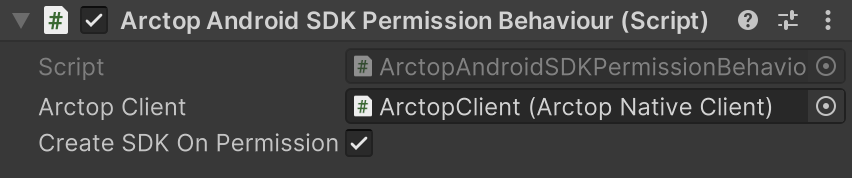
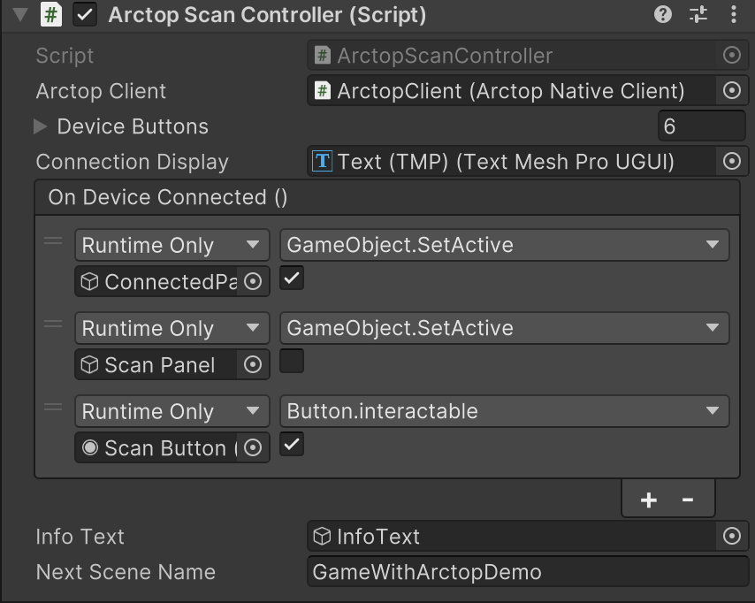
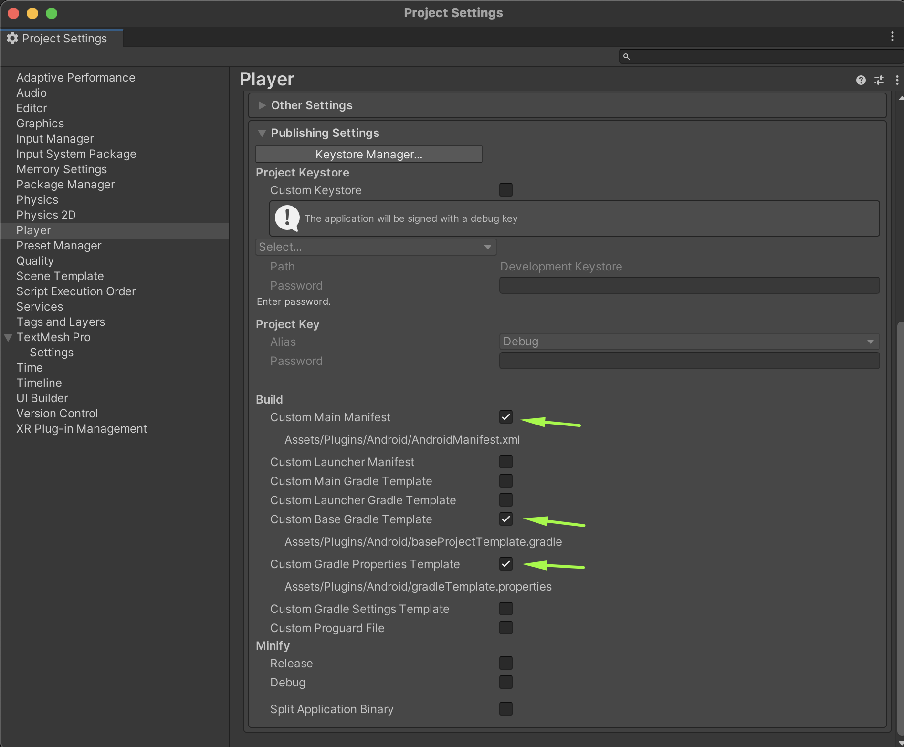
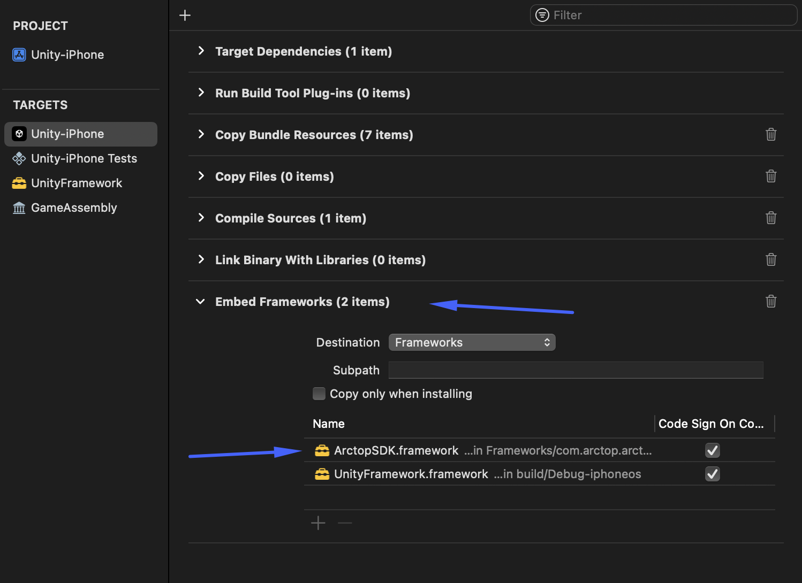
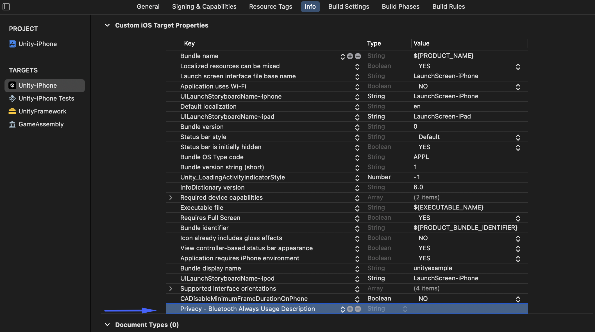

# Arctop Unity Package

The Arctop Unity package is a full-fledged SDK allowing access to Arctop's BCI functionality within the Unity ecosystem.

The plugin currently supports builds for Android and iOS devices, with a mock editor functionality to provide quick iteration.

<!-- TOC -->
* [Arctop Unity Package](#arctop-unity-package)
  * [SDK Documentation](#sdk-documentation)
  * [Installation](#installation)
  * [General](#general)
  * [SDK Flow](#sdk-flow)
  * [Permissions (Android only)](#permissions-android-only)
  * [Initialization / Destruction](#initialization--destruction)
  * [Example Project](#example-project)
  * [Package Components](#package-components)
    * [ArctopNativeClient](#arctopnativeclient)
    * [ArctopAndroidSDKPermissionBehaviour](#arctopandroidsdkpermissionbehaviour)
    * [ArctopSDK](#arctopsdk)
    * [ArctopNativePlugin](#arctopnativeplugin)
    * [Listeners / Java Proxies](#listeners--java-proxies)
  * [Quality Assurance / Signal Quality](#quality-assurance--signal-quality)
  * [Build Setup](#build-setup)
    * [Android Setup](#android-setup)
    * [iOS Setup](#ios-setup)
<!-- TOC -->

## SDK Documentation

Before continuing, please first refer to the SDK documentation for [Android](https://github.com/arctop/android-sdk/blob/main/arctopSDK/README.md) or [iOS](https://github.com/arctop/iOS-SDK/blob/main/README.md). These documents provide the basic foundation to understanding the Arctop SDK and the process of utilizing it.

This Unity SDK guide covers the usage of the Unity plugin that connects to the Arctop SDK for both platforms, and it is imperative that you understand the Arctop SDK's processes beforehand.

## Installation

Use the Unity package manager to add this package from a git url. Refer to the Unity manual for package installation instructions for your specific Unity version.

## General

The native plugin contains a few pieces under the hood.

Initially, there are the SDK Framework(iOS) / AndroidLib(Android), residing in their respective Plugin folders.
Those contain the native API for the respective platform.

For Unity, there are a few key C# scripts:

_ArctopNativePlugin.cs_ is the Unity ↔ Native binding. This class defines all the C / Java bindings and delegates that provide the option to cross the Unity ↔ Native boundary.

_ArctopNativeClient.cs_ is a C# Monobehaviour that provides a wrapper around the native functionality, with a public API and UnityEvents allowing linkage of callbacks from the Editor. This class also provides mock functionality inside the editor, which allows testing in editor without the need to build to device.

These two classes are the heart of the package. Other classes and their purpose are described later in [this document](#package-components).

## SDK Flow

The SDK flow is important to understand, and is described in the [documentation above](#sdk-documentation).

To recap, the flow is Permissions/Binding(Android only) -> Init -> Check login status -> Login -> Check calibration status -> Scan device -> Connect -> Run predictions -> Shut down.

## Permissions (Android only)

The _ArctopAndroidSDKPermissionBehaviour.cs_ is available to provide handling of the Arctop data permission a user must grant your app before SDK initialization can occur.
The behavior is configured to run, create, and initialize the native SDK once permission is granted. Alternatively, you can handle permissions on your own.

Since under the hood the SDK operates as an Android service, the Unity client needs to bind to that service before Initializing.

All these flows are handled automatically and are provided with callbacks, so you can react to the different states and events within Unity.

On iOS, this class just calls initialization on the SDK, to allow identical scene setup for both platforms.

## Initialization / Destruction

Before being able to use any of the SDK’s functionality, there is a need to initialize it.

The _ArctopNativeClient_ has an API Key field that will need to be filled in order for initialization to succeed.

There is a checkbox titled “Handle SDK Init”. Having this checked will initialize the SDK on Awake.
The other alternative is to use the _ArctopAndroidSDKPermissionBehaviour.cs_ as mentioned [above](#permissions-android-only).
The counterpart “Handle SDK Destroy” is also available, which will be called during OnDestroy.

Every init call needs to be offset by a destroy call. **However**, there is no need to do that in the same scene. This allows having multiple ArctopSDKClient objects in different scenes, and as long as the first one will init and the last one will destroy, the SDK will work. Note that after destruction, an init must be called. There is no limitation on the amount of Init/Destroy pairs that can be called. However, it is important to note that initialization is an expensive process.

## Example Project

The package contains a few examples. 

The main one **Game Example** demonstrates a complete project setup.
The scene named **ArctopSDKStartHere** is set up with UI to handle the entire initial setup, following the (Permissions) → Init → Login → Scan → Connect → Start Prediction steps.

Once Start Prediction is called and succeeds, the app will change scene to the scene that is defined on the ArctopScanController component, on the Scan Panel Object.

The GameWithArctopDemo scene is just a simple UI showing the QA and Values arriving from the prediction. It also provides a finish button and an exit button. The SDK is also destroyed when the scene finishes.

You can use the example as a reference for scene / project setup.

## Package Components

### ArctopNativeClient

The native client class / behavior is the entry point and event launcher for all your coding and editor needs with the native plugin.

Most of the functionality is asynchronous and responses from functions will be delivered via events. As events from the native side arrive in different threads, they are put into a queue and are dispatched one at a time at each Update() cycle. This allows the calls to run on Unity’s main thread, retains order of arrival, and makes sure to not clog the main thread with too many calls.

This means that any function that is invoked in response to an event will be run in a single frame, so consider delegating long-running operations to coroutines or tasks.

Check the [source file](Runtime/com/arctop/ArctopNativeClient.cs) for this class for documentation of all functions and callbacks.

### ArctopAndroidSDKPermissionBehaviour

This behavior is used to provide permission handling for Android, and the SDK Creation -> Binding -> Initialization flow for both platforms.

### ArctopSDK

Static class holding all the response codes, enums, and constants used.

### ArctopNativePlugin

Native plugin bindings for both platforms.

### Listeners / Java Proxies

ArctopSDKCallback

ArctopSDKSuccessOrFailureCallback

ArctopServiceBindCallback

All these classes are used internally and aren't required for your interactions.

## Quality Assurance / Signal Quality

The SDK has 2 QA components. During a prediction, it will report a pass/fail and a reason for failure.
It is generally good practice to notify the user of these errors.

Before starting a session, the SDK will evaluate the signal quality of each electrode on the headband.
It will report the values at a high rate, and the com.arctop.qa components are available to display a visualization of the data.

You can use the QASensor prefab as a starting point or as is.

There is a QA Example available with the isolated prefab in a scene for reference.

## Build Setup

### Android Setup

To successfully build the project for Android, you will need to add a few settings for the manifest and build.gradle files.

If you do not have your own templates, add those in the publishing settings:

**Player Settings -> Publishing**

Add to the Android manifest inside the <manifest> tags:

    <uses-permission android:name="com.arctop.permission.ARCTOP_DATA" />

In the baseProjectTemplate.gradle, add before **BUILD_SCRIPT_DEPS**:

    id "org.jetbrains.kotlin.jvm" version "1.9.20"

Make sure to verify the correct version for Kotlin and your project.

Next, delete the: 

    task clean(type: Delete) {
    delete rootProject.buildDir
    }

In the gradleTemplate.properties, add:

    android.useAndroidX=true

before unityStreamingAssets=**STREAMING_ASSETS**.

You can see an example of the files from the AndroidBuildFiles sample.

### iOS Setup

In order to make sure that the project embeds Arctop's framework correctly, select your target and, under the build phases, open the "Embed Frameworks" section and add ArctopSDK.framework.

The SDK requires bluetooth permissions in order to work correctly.

After you have built your project and opened it in XCode, add the **Privacy - Bluetooth always usage description** key to your info section of your target, and add a text for the dialog that appears at the start of the app.

